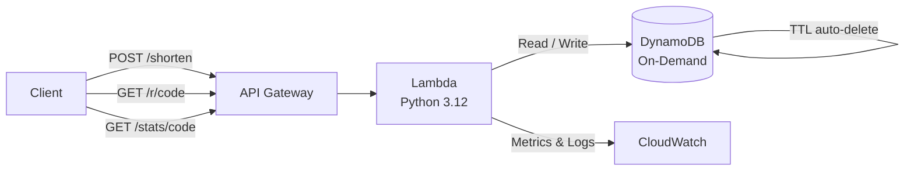

# Serverless URL Shortener


A production-ready URL shortener built entirely on AWS serverless services.  
Zero fixed infrastructure cost — runs 100% within the AWS Free Tier.

---

## Architecture



| Component     | Service              | Free Tier limit                     |
|---------------|----------------------|-------------------------------------|
| API           | API Gateway          | 1M calls/month                      |
| Compute       | Lambda               | 1M invocations/month, 400K GB-s     |
| Database      | DynamoDB On-Demand   | 25 WCU, 25 RCU, 25 GB storage       |
| Observability | CloudWatch           | 10 custom metrics, 5 GB logs        |

---

## API Reference

### `POST /shorten`
Shorten a URL.

**Request body:**
```json
{
  "url": "https://example.com/very/long/path",
  "ttl_days": 30
}
```

**Response `201`:**
```json
{
  "short_url": "https://xyz.execute-api.eu-west-1.amazonaws.com/prod/r/a3f9c12",
  "short_code": "a3f9c12",
  "original_url": "https://example.com/very/long/path",
  "expires_in_days": 30
}
```

---

### `GET /r/{code}`
Redirects to the original URL (`301`).

---

### `GET /stats/{code}`
Returns click statistics.

**Response `200`:**
```json
{
  "short_code": "a3f9c12",
  "original_url": "https://example.com/very/long/path",
  "short_url": "https://xyz.execute-api.eu-west-1.amazonaws.com/prod/r/a3f9c12",
  "click_count": 42,
  "created_at": "2024-06-01T10:30:00+00:00"
}
```

---

## Project Structure

```
aws-url-shortener/
├── src/
│   └── handler.py            # Lambda handler — all routes
├── infrastructure/
│   └── template.yaml         # SAM / CloudFormation template
├── tests/
│   └── test_handler.py       # Unit tests (pytest)
└── .github/
    └── workflows/
        └── ci.yml            # CI/CD — test + deploy on push to main
```

---

## Deploy

### Prerequisites
- [AWS CLI](https://docs.aws.amazon.com/cli/latest/userguide/install-cliv2.html) configured
- [AWS SAM CLI](https://docs.aws.amazon.com/serverless-application-model/latest/developerguide/install-sam-cli.html)
- Python 3.12+

### 1. Clone and build
```bash
git clone https://github.com/YOUR_USERNAME/aws-url-shortener.git
cd aws-url-shortener
sam build --template infrastructure/template.yaml
```

### 2. Deploy
```bash
sam deploy --guided
```
Follow the prompts. SAM will output your API endpoint URL at the end.

### 3. Test locally
```bash
pip install pytest boto3
pytest tests/ -v
```

---

## CI/CD

Every push to `main` triggers the GitHub Actions pipeline:

1. **Test** — runs pytest against all unit tests
2. **Deploy** — SAM build + deploy to AWS (requires `AWS_ACCESS_KEY_ID` and `AWS_SECRET_ACCESS_KEY` secrets in the repo)

---

## Key Design Decisions

- **Single Lambda function** with internal routing keeps cold starts minimal and IAM permissions simple.
- **DynamoDB TTL** automatically expires old links at zero cost — no cron job needed.
- **On-Demand billing** on DynamoDB means no capacity planning and stays within free tier for portfolio usage.
- **Atomic counter** (`update_item` with `ADD`) ensures click counts are accurate even under concurrent traffic.

---

## AWS Services Used

`API Gateway` · `Lambda` · `DynamoDB` · `CloudWatch` · `IAM` · `SAM`

---

## Author

**Your Name** · [LinkedIn](https://linkedin.com/in/yourprofile) · [GitHub](https://github.com/YOUR_USERNAME)
